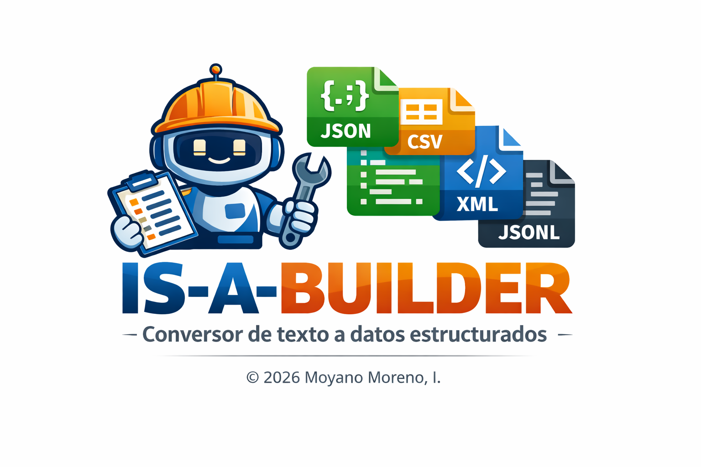

<p align="center">
  
</p>

**IS-A-BUILDER** es una herramienta pedagógica diseñada para estudiantes e investigadores que se inician en el **Procesamiento del Lenguaje Natural (PLN)**. Su objetivo es facilitar la transición de archivos de texto plano (`.txt`) a formatos de datos estructurados e interoperables.

> Funciona íntegramente en el navegador — no requiere instalación ni conexión a ningún servidor.

## Funcionalidades

- **Carga flexible:** sube archivos `.txt` (múltiples, con arrastrar y soltar) o pega texto directamente.
- **Tokenización por oraciones:** segmentación automática con gestión de abreviaturas en español.
- **Preprocesamiento:** normalización a minúsculas y eliminación de puntuación.
- **Estructura personalizable:** define la etiqueta de contenido y las etiquetas de metadatos que necesites.
- **Métricas en tiempo real:** conteo de ítems, palabras y caracteres.
- **Exportación multi-formato:** descarga el dataset en **JSON, JSONL, CSV y XML**.

## Uso en línea (recomendado)

👉 **[https://isabel-mm.github.io/IS-A-BUILDER/](https://isabel-mm.github.io/IS-A-BUILDER/)**

No hace falta instalar nada. Abre el enlace y empieza a trabajar.

## Uso local

Descarga o clona el repositorio y abre `index.html` directamente en cualquier navegador moderno.

```bash
git clone https://github.com/isabel-mm/IS-A-BUILDER.git
cd IS-A-BUILDER
open index.html   # macOS
# xdg-open index.html  # Linux
```

## Versión Streamlit (legacy)

La versión original basada en Python sigue disponible en `app.py`:

```bash
pip install -r requirements.txt
streamlit run app.py
```

## Cita sugerida

Moyano Moreno, I. (2026). *IS-A-BUILDER: conversor de texto a datos estructurados* [Software]. https://doi.org/10.5281/zenodo.18494400

---
Desarrollado con ❤️ por **Isabel Moyano Moreno** para mis alumnos y otros curiosos e interesados en el PLN.
