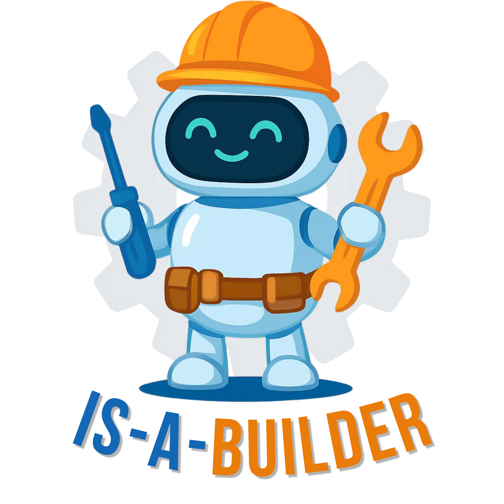

<p align="center">
  
</p>

**IS-A-BUILDER** es una herramienta pedagógica diseñada para estudiantes e investigadores que se inician en el **Procesamiento del Lenguaje Natural (PLN)** y en la **lingüística de corpus**. Su objetivo es facilitar la transición de texto plano (`.txt`) o de páginas web (`.html`, por ejemplo artículos de Wikipedia o noticias de prensa digital) a formatos de datos estructurados e interoperables.

> Funciona ín## Funcionalidades

- **Carga flexible:** sube archivos `.txt` o `.html` (varios a la vez, con arrastrar y soltar) o pega texto directamente.
- **Extracción de texto de páginas web:** de una página guardada en `.html` (Wikipedia, prensa digital como *El País*, etc.) se extraen los párrafos del texto principal, sin tablas ni imágenes. En Wikipedia se descartan además las fichas, las llamadas a notas y las referencias.
- **Tokenización por oraciones:** segmentación automática con gestión de abreviaturas en español.
- **Preprocesamiento:** normalización a minúsculas y eliminación de palabras funcionales (español e inglés, según el idioma detectado).
- **Anotación:** edita las celdas de la vista previa y añade o quita etiquetas de metadatos después de procesar.
- **Estadísticas descriptivas:** número de filas, TTR (riqueza léxica), porcentaje de hapax y lista completa de frecuencias.
- **Exportación multiformato:** descarga el corpus en **JSON, JSONL, CSV, XML y TXT**, las frecuencias en **CSV o Excel** y las estadísticas en **JSON**.

La propia aplicación incluye una **guía de uso** con el paso a paso y para qué sirve cada formato.

## Uso en línea (recomendado)

👉 **[https://isabel-mm.github.io/IS-A-BUILDER/](https://isabel-mm.github.io/IS-A-BUILDER/)**

No hace falta instalar nada. Abre el enlace y empieza a trabajar.

## Uso local

Descarga o clona el repositorio y abre `index.html` directamente en cualquier navegador moderno.

El código está repartido en `index.html` (estructura), `styles.css` (estilos), `app.js` (lógica) y `stopwords.js` (listas de palabras funcionales). Los cuatro archivos deben estar en la misma carpeta.

```bash
git clone https://github.com/isabel-mm/IS-A-BUILDER.git
cd IS-A-BUILDER
open index.html   # macOS
# xdg-open index.html  # Linux
```

## Versión Streamlit (legacy)

La versión original basada en Python sigue disponible en `app.py`. Solo acepta archivos `.txt` y no incluye las novedades de la versión web (extracción de HTML, etiquetas tras procesar, exportación en TXT):

```bash
pip install -r requirements.txt
streamlit run app.py
```

## Cita sugerida

Moyano Moreno, I. (2026). *IS-A-BUILDER: conversor de texto a datos estructurados* [Software]. https://doi.org/10.5281/zenodo.18494400

---
Desarrollado con ❤️ por **Isabel Moyano Moreno** para mis alumnos y otros curiosos e interesados en el PLN y la lingüística de corpus.
